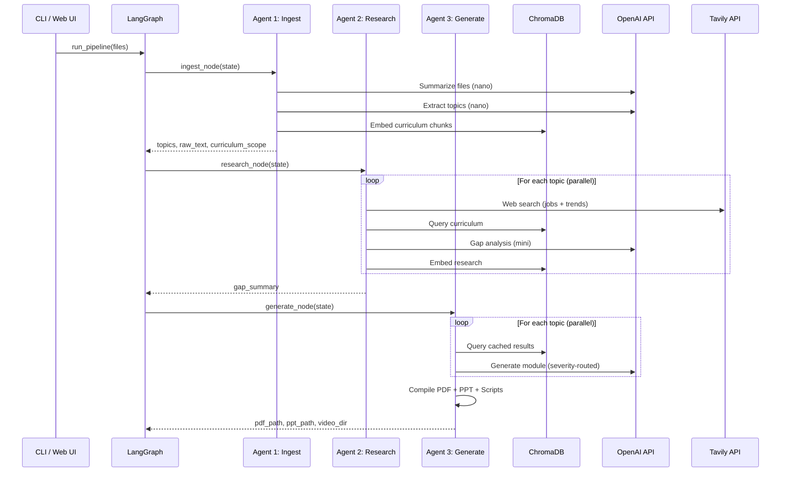

# Pipeline Agents

CR8's pipeline consists of three specialized agents, each responsible for a distinct phase of the learning guide generation process. All agents run sequentially via LangGraph, sharing state through a `PipelineState` TypedDict.

- **[Agent 1: Ingest](ingest.md)** -- Parse files, extract topics, build vector knowledge base
- **[Agent 2: Research](research.md)** -- Web search, gap analysis, store enrichments
- **[Agent 3: Generate](generate.md)** -- Generate modules, compile PDF/PPT/scripts/videos
- **[Prompt Templates](prompts.md)** -- All prompt templates documented
