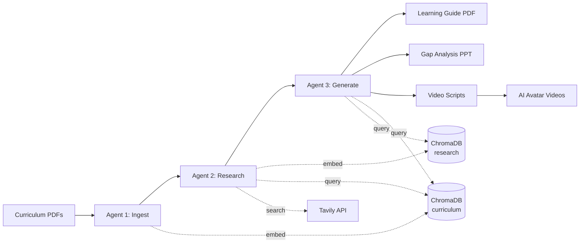

# Architecture

CR8 uses a linear 3-agent pipeline orchestrated by LangGraph. Each agent is a node in a directed graph, passing state forward through a shared `PipelineState` dictionary.

## Explore This Section

- **[Pipeline Overview](pipeline-overview.md)** -- LangGraph graph definition and project structure
- **[Data Flow & State](data-flow.md)** -- PipelineState TypedDict and data accumulation
- **[Technology Stack](tech-stack.md)** -- Components, libraries, and rationale
- **[Multi-Model Routing](model-routing.md)** -- 3-tier model system with severity-based routing
- **[Output Chain](output-chain.md)** -- PDF -> PPT -> Script -> Video dependency chain
