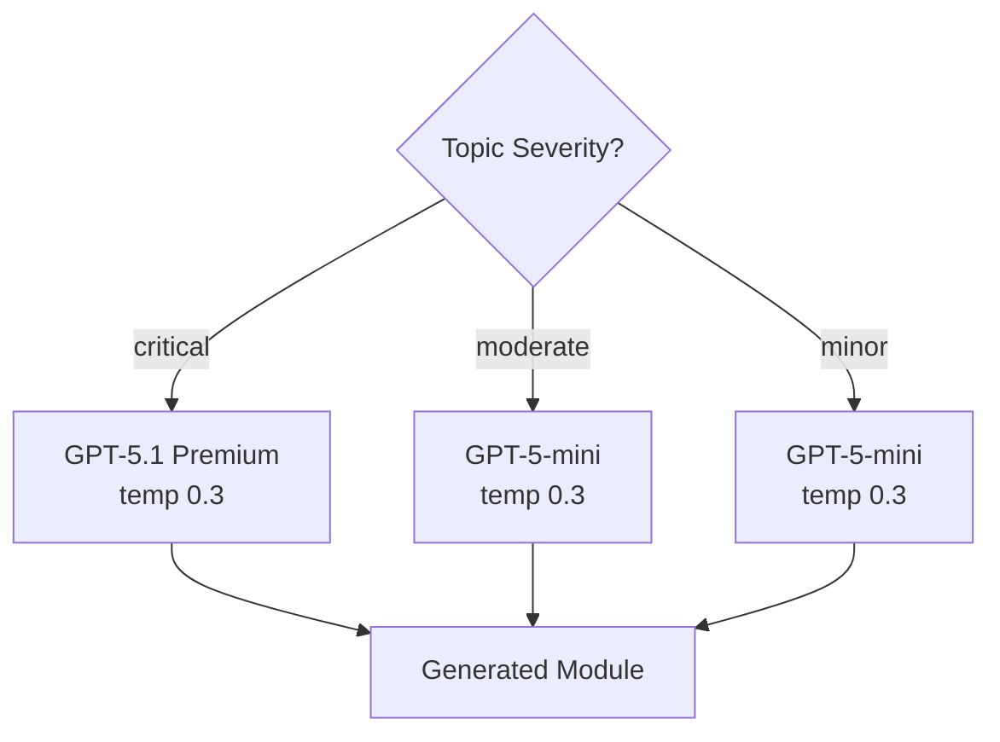

# Multi-Model Routing

CR8 uses a 3-tier model system to balance cost, quality, and speed across different pipeline tasks.

## The 3-Tier System

| Tier | Model | Default Temperature | Use Cases |
|------|-------|-------------------|-----------|
| Nano | GPT-5-nano | 0.2 | File summarization, topic extraction, PPT executive summary |
| Mini | GPT-5-mini | 0.3 | Gap analysis, moderate/minor module generation, PPT per-topic slides |
| Premium | GPT-5.1 | 0.55 | Critical module generation, video scripts |

The LLM wrapper (`backend/services/llm.py`) exposes a `get_llm(tier, temperature=None)` function that returns a configured `ChatOpenAI` instance for the requested tier. Temperature can be overridden per-call.

```python
from backend.services.llm import get_llm

nano = get_llm("nano")                             # GPT-5-nano, temp 0.2
mini = get_llm("mini")                             # GPT-5-mini, temp 0.3
premium = get_llm("premium")                       # GPT-5.1, temp 0.55
script_llm = get_llm("premium", temperature=0.55)  # Explicit override
```

## Severity-Based Routing

The research agent assigns a severity level (`critical`/`moderate`/`minor`) to each topic based on gap analysis. The generate agent uses this to route model selection:

- **Critical** topics -> GPT-5.1 (premium) for highest quality
- **Moderate** topics -> GPT-5-mini for balanced cost/quality
- **Minor** topics -> GPT-5-mini for efficient processing



This concentrates premium model budget where quality matters most -- topics with critical gaps get the best model, while topics with minor gaps use the cheaper model with no meaningful quality loss.

## Task-to-Model Matrix

| Pipeline Stage | Task | Model Tier | Temperature |
|---------------|------|------------|-------------|
| Ingest | File summarization | Nano | 0.2 |
| Ingest | Chunk summarization (map-reduce) | Nano | 0.2 |
| Ingest | Summary reduction (map-reduce) | Nano | 0.2 |
| Ingest | Topic extraction | Nano | 0.2 |
| Research | Gap analysis | Mini | 0.2 |
| Generate | Module generation (critical) | Premium | 0.3 |
| Generate | Module generation (moderate/minor) | Mini | 0.3 |
| Generate | PPT per-topic slide structuring | Mini | 0.3 |
| Generate | PPT executive summary | Nano | 0.2 |
| Generate | Video script writing | Premium | 0.55 |

## Temperature Presets

| Preset | Value | Tasks |
|--------|-------|-------|
| `TEMP_ANALYSIS` | 0.2 | Summarization, extraction, gap analysis |
| `TEMP_STRUCTURED` | 0.3 | Module generation, PPT structuring |
| `TEMP_CREATIVE` | 0.55 | Video script writing |

Lower temperatures produce more deterministic, factual output -- suitable for extraction and analysis tasks. Higher temperatures allow more creative variation -- suitable for narration scripts that need to sound natural and engaging.

## Module Quality Validation

After generation, each module is validated for:

1. **Required sections** -- Must contain `## Module Overview`, `## Learning Objectives`, `## Core Content`, and `## Key Takeaways`
2. **Minimum length** -- Must exceed 2,000 characters

Failed modules are retried up to 2 times with the same model tier. This catches cases where the LLM produces truncated or malformed output.

## Configuration

All model settings are configurable via environment variables (see [Configuration](../getting-started/configuration.md)):

| Variable | Default | Description |
|----------|---------|-------------|
| `OPENAI_MODEL_PREMIUM` | `gpt-5.1` | Premium tier model |
| `OPENAI_MODEL_MINI` | `gpt-5-mini` | Mini tier model |
| `OPENAI_MODEL_NANO` | `gpt-5-nano` | Nano tier model |
| `TEMP_ANALYSIS` | `0.2` | Temperature for analysis tasks |
| `TEMP_STRUCTURED` | `0.3` | Temperature for structured generation |
| `TEMP_CREATIVE` | `0.55` | Temperature for creative writing |
