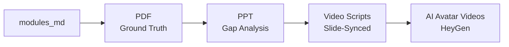

# Output Chain

CR8 generates outputs in a dependency chain where each output builds on the previous one.

## The Dependency Chain



## How Each Output Builds on the Previous

1. **Modules (markdown)** -- Generated per-topic from curriculum + research + gap analysis. Each module contains seven sections: Curriculum Coverage, Identified Gaps, Learning Objectives, Core Content, Industry Context, Key Takeaways, and Further Reading. Severity-based model routing selects GPT-5.1 for critical topics and GPT-5-mini for moderate/minor topics.

2. **PDF** -- Compiled from modules using fpdf2. This is the ground truth document. Includes a cover page, table of contents, and one chapter per topic with rich text rendering (bold, italic, code blocks). The PDF builder sanitizes Unicode characters for Helvetica/latin-1 compatibility.

3. **PPT** -- Structured around the PDF content. The LLM receives PDF module content plus gap analysis data and produces structured JSON for six slide types: title, executive summary, severity overview, per-topic gap detail, recommendations, and closing. Per-topic slides are generated in parallel (GPT-5-mini), and the executive summary uses GPT-5-nano.

4. **Scripts** -- Each script is synced to its PPT slide. The `SCRIPT_FROM_SLIDES` prompt receives the PPT slide structure, the PDF module content, and research/gap data for that specific topic. Output uses `[SLIDE N: title]` markers mapping 1:1 to PPT slides. Each script receives only its own topic's data (filtered context), saving ~86% on input tokens compared to passing all modules. Hook variety is enforced across scripts using thread-safe tracking.

5. **Videos** -- HeyGen API v2 renders scripts as AI avatar videos. Configurable avatar emotion (`Friendly` default), speech speed (1.05x default), and parallel generation (4 concurrent jobs default). Limited to `VIDEO_TOPIC_LIMIT` topics (default 5).

## Format Selection

When running the pipeline, format dependencies are automatic:

- Selecting `video` auto-enables `script`
- Selecting `script` auto-enables `ppt`
- `pdf` is always generated

```bash
# PDF only (default)
python -m backend.run_pipeline files.pdf

# PDF + PPT
python -m backend.run_pipeline files.pdf --format pdf,ppt

# PDF + PPT + Scripts
python -m backend.run_pipeline files.pdf --format pdf,script

# Full chain: PDF + PPT + Scripts + Videos
python -m backend.run_pipeline files.pdf --format pdf,video
```

The web UI enforces the same dependencies with checkbox logic: checking "Script" auto-checks "PPT", checking "Video" auto-checks both "PPT" and "Script", and unchecking "PPT" auto-unchecks "Script" and "Video".

## Fallback Behavior

If PPT is not selected but scripts are requested, the pipeline falls back to per-module script generation using the `MODULE_TO_SCRIPT` prompt, which converts a learning module directly to a 2-minute spoken-word script without slide synchronization.

## Parallel Execution

Within the generate agent, PDF and PPT structuring run in parallel when both formats are requested. Script generation follows after PPT is complete (since scripts depend on slide structure). Video rendering then runs in parallel across topics using a separate `ThreadPoolExecutor` with `VIDEO_MAX_WORKERS` (default 4).

```
                    ┌─────────┐
                    │ Modules │  (parallel per topic)
                    └────┬────┘
                         │
                ┌────────┴────────┐
                │                 │
           ┌────▼────┐     ┌─────▼─────┐
           │  PDF    │     │ PPT LLM   │  (parallel)
           │ build   │     │ structuring│
           └────┬────┘     └─────┬─────┘
                │                │
                │           ┌────▼────┐
                │           │  PPT    │
                │           │  build  │
                │           └────┬────┘
                │                │
                │           ┌────▼────┐
                │           │ Scripts │  (parallel per topic)
                │           └────┬────┘
                │                │
                │           ┌────▼────┐
                │           │ Videos  │  (parallel per topic)
                │           └────┬────┘
                │                │
                └────────┬───────┘
                         │
                    ┌────▼────┐
                    │  Done   │
                    └─────────┘
```
