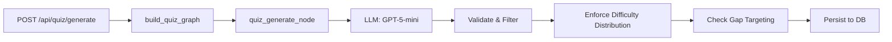

# Quiz Agent

The Quiz Agent is a standalone LangGraph workflow that generates multiple-choice questions (MCQs) from completed pipeline output. Unlike the main pipeline agents (Ingest, Research, Generate), the Quiz Agent runs **on-demand** when a user requests a quiz — it is NOT a 4th pipeline node.

## Architecture



The quiz graph is compiled from `backend/pipeline/quiz_graph.py` as a single-node `StateGraph(QuizState)`:

```
START → generate_questions → END
```

## QuizState

Defined in `backend/pipeline/quiz_state.py`, separate from the main `PipelineState`:

| Field | Type | Description |
|-------|------|-------------|
| `job_id` | `str` | Source pipeline job ID |
| `user_id` | `str` | Authenticated user ID |
| `topics` | `list[dict]` | Topics extracted by the pipeline |
| `modules_md` | `list[str]` | Generated module markdown content |
| `gap_summary` | `list[dict]` | Knowledge gap analysis data |
| `curriculum_scope` | `str` | Curriculum scope (e.g., "Computer Science") |
| `question_count` | `int` | Target number of questions (default: 20) |
| `questions` | `list[dict]` | Output: generated question dicts |

## Question Generation

The agent generates questions using `get_llm("mini")` with a structured prompt that enforces:

- **4-option MCQ format** with exactly one correct answer
- **Bloom's taxonomy tagging** (remember, understand, apply, analyze, evaluate, create)
- **Difficulty distribution**: 30% easy, 50% medium, 20% hard
- **Gap targeting**: At least 40% of questions target identified knowledge gaps
- **Structured JSON output** via `response_format={"type": "json_object"}`

### Question Schema

Each generated question contains:

| Field | Type | Description |
|-------|------|-------------|
| `question_text` | `str` | The question prompt |
| `question_type` | `str` | Always `"mcq"` |
| `options` | `list[str]` | Exactly 4 answer options |
| `correct_index` | `int` | Index (0-3) of the correct option |
| `difficulty` | `str` | `easy`, `medium`, or `hard` |
| `blooms_level` | `str` | Bloom's taxonomy level |
| `source_section` | `str` | Which content section this targets |
| `feedback_correct` | `str` | Feedback shown on correct answer |
| `feedback_incorrect` | `str` | Feedback shown on wrong answer |
| `topic` | `str` | Topic name |

### Post-Generation Processing

After LLM generation, the agent applies:

1. **Validation** — Rejects questions with missing fields, wrong option count, or invalid `correct_index`
2. **Difficulty distribution** — Rebalances to 30/50/20 easy/medium/hard, reassigning from overrepresented categories
3. **Gap percentage check** — Logs a warning if fewer than 40% of questions target knowledge gaps

## API Endpoints

| Method | Path | Description |
|--------|------|-------------|
| `POST` | `/api/quiz/generate` | Generate quiz from a completed job |
| `GET` | `/api/quiz/{quiz_id}` | Fetch quiz with questions (answers hidden until attempted) |
| `POST` | `/api/quiz/{quiz_id}/submit` | Submit answers, get scored results |
| `GET` | `/api/quiz/{quiz_id}/results` | Get per-question feedback for completed attempt |
| `GET` | `/api/quiz/by-job/{job_id}` | List quizzes for a job |

### Answer Security

- Before a user completes an attempt, `correct_index`, `feedback_correct`, and `feedback_incorrect` are stripped from the API response
- After submission, the full question data (including correct answers and feedback) is returned
- Each quiz allows exactly one attempt per user (enforced by `UNIQUE(quiz_id, user_id)` constraint)
- Duplicate submissions return HTTP 409

## React UI

### QuizPage (`/quiz/:quizId`)

One-question-at-a-time view with:

- Previous/Next navigation between questions
- Progress bar showing answered count
- Submit button (enabled only when all questions answered)
- Automatic redirect to results if already attempted

### QuizResultsPage (`/quiz/:quizId/results`)

- Score summary with percentage, fraction, and color-coded label (green/amber/red)
- Per-question review with correct/incorrect highlighting and feedback text
- Back to Dashboard link

### Components

| Component | Purpose |
|-----------|---------|
| `QuestionCard` | Single MCQ with option buttons, difficulty badge, review mode |
| `QuizProgressBar` | Progress indicator with question counter |
| `ScoreSummary` | Score circle with percentage and label |

## Database Tables

The quiz feature uses four tables (defined in `backend/db/schema.sql`):

- `quizzes` — Quiz metadata (job_id, user_id, title)
- `quiz_questions` — Question content with JSONB options
- `quiz_attempts` — One attempt per user per quiz, with score
- `quiz_responses` — Per-question answers with correctness

## Files

| File | Purpose |
|------|---------|
| `backend/prompts/quiz.py` | Quiz generation prompt template |
| `backend/pipeline/quiz_state.py` | QuizState TypedDict |
| `backend/pipeline/agent_quiz.py` | Quiz generation node + helpers |
| `backend/pipeline/quiz_graph.py` | Single-node StateGraph compilation |
| `frontend/quiz_models.py` | Pydantic request models |
| `frontend/quiz_routes.py` | 5 API endpoints |
| `frontend/react-app/src/api/quiz.ts` | TypeScript API client |
| `frontend/react-app/src/pages/QuizPage.tsx` | Quiz-taking page |
| `frontend/react-app/src/pages/QuizResultsPage.tsx` | Results review page |
| `frontend/react-app/src/components/quiz/` | QuestionCard, QuizProgressBar, ScoreSummary |
