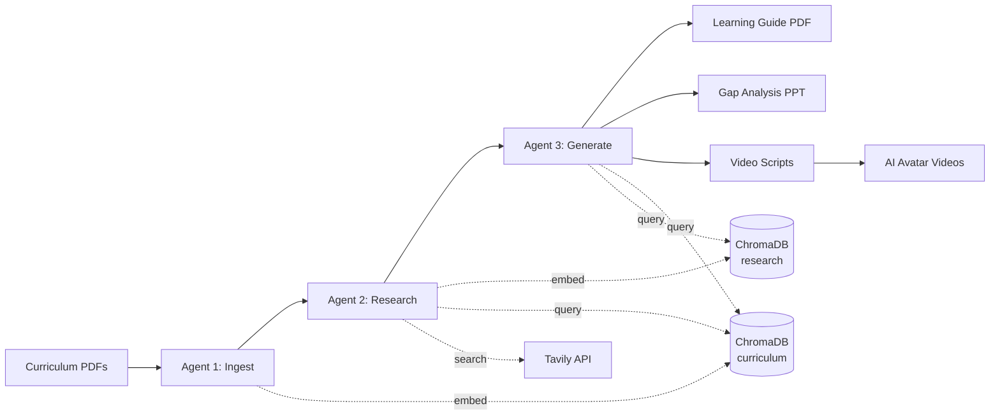

# CR8 Loop Intelligence — Implementation & Strategy Brief

Doc file to summarise technical implementation such that the strategic roadmap can be built by the business agent (not present in the codebase) without needing to read through all the code.

**Last Updated**: 2026-03-03

---

## What CR8 Is

CR8 is a 3-agent AI pipeline that transforms university curriculum materials (PDFs, slides) into market-enriched learning guides. The core thesis: **curriculum in, industry-contextualized learning content out**.



Built with LangGraph, OpenAI, ChromaDB, Tavily, fpdf2, and FastAPI. The prototype is fully operational as both a CLI tool and a web application deployed on GCP Cloud Run.

---

## Current Implementation Status

The prototype is **complete and deployed**.

### The 3-Agent Pipeline (Working)

**Ingest Agent** — Parses uploaded curriculum files (PDF/PPTX), uses GPT-5-nano to summarize each file in parallel (with map-reduce for files >15K chars), extracts 10-25 structured topics (with key techniques, domain context, and a curriculum scope boundary), chunks and embeds everything into ChromaDB's `curriculum` collection. Produces a topic list and a one-sentence `curriculum_scope` that constrains all downstream agents from drifting off-topic.

**Research Agent** — Takes each topic and runs two parallel Tavily web searches per topic (job skills/applications + industry trends/alternatives), retrieves matching curriculum chunks from ChromaDB, feeds all of it to GPT-5-mini for structured gap analysis (JSON mode) with severity rating (critical/moderate/minor), and stores enrichments in ChromaDB's `research` collection. All topics researched concurrently via ThreadPoolExecutor.

**Generate Agent** — Retrieves context from both ChromaDB collections for each topic (cached once, reused across generation and script stages), looks up its gap analysis, and uses severity-based model routing: critical topics get GPT-5.1 (premium), moderate/minor topics get GPT-5-mini. Each module is validated for required sections and minimum length with up to 2 retries. Generates learning modules in markdown with 7 sections: Curriculum Coverage, Identified Gaps, Learning Objectives (tagged Curriculum/Gap), Core Content, Industry Context, Key Takeaways (grouped Curriculum/Gap/Integration), and Further Reading. All modules generate in parallel, then compile into a chained output set: PDF (ground truth) → PPT (gap analysis slides structured around PDF chapters) → Video Script (synced to PPT slides with [SLIDE N] markers) → Video (via HeyGen API).

### Web UI (Working)

FastAPI web frontend with PDF upload (drag-and-drop), format selection with dependency chain (PDF always on, PPT optional, Script auto-enables PPT, Video auto-enables Script+PPT — disabled pending HeyGen keys), real-time progress tracking with stage labels and progress bar (polling every 3s), and file download. ProgressCapture intercepts stdout and parses stage prefixes with weighted stages: Ingest 15%, Research 50%, Generate 25%, Script 8%, Video 2%.

### Deployment (Working)

Dockerized on GCP Cloud Run (europe-west2). Single container with Gunicorn + Uvicorn, ephemeral ChromaDB, secrets from GCP Secret Manager. Scales to zero when idle (~$0 cost), cold starts in 30-60s. Configuration: 2 GiB RAM, 2 vCPU, 3600s timeout, max 1 instance, `max_workers=12`.

### Recent Engineering Milestones (Feb 2026)

!!! success "Security layer (`8d467db`)"
    Password-protected access added: bcrypt-hashed password, 256-bit server-side session tokens (8-hour TTL), IP-based rate limiting (5 attempts per 15 min), `BaseHTTPMiddleware` as outermost ASGI layer that intercepts every request before FastAPI routing. Upload endpoint validates PDF magic bytes (`%PDF-`), enforces 20 MB cap, sanitizes filenames, validates `job_id` format (`^[a-f0-9]{8}$`) before any filesystem access. AI pipeline hardened against adversarial PDFs: `_sanitize()` strips control characters from extracted text; all document content wrapped in `<document>` tags with privilege-separation notice (OWASP LLM01). 48 new endpoint tests added, all passing. **The Cloud Run URL can now be shared externally.**

!!! success "Concurrency raised (`b41e94a`)"
    `ThreadPoolExecutor max_workers` increased from 8 → 12; `video_max_workers` raised to 12. Video pipeline restructured into two-phase: sequential TTS (shared engine) → parallel ffmpeg composition. A full 15-topic curriculum set now processes in approximately 4-5 minutes on the 2 vCPU Cloud Run configuration (without video).

!!! success "Pipeline stability (`fddbab3`, `0725c09`)"
    All three LangGraph agents now catch and log exceptions per-topic rather than crashing the entire run. ChromaDB `add()` call skips empty document batches (race condition fix). `ProgressCapture` uses a threading lock for thread-safe stdout updates. `get_event_loop()` replaced with `get_running_loop()` (correct async context). Pipeline is stable for repeated multi-session use.

### Test Coverage

626 tests passing. Covers file parsing, ChromaDB operations, PDF generation edge cases (Unicode, malformed markdown, special characters), run_job validation, all FastAPI endpoints, ProgressCapture thread safety (including stage-aware ETA), auth flows, upload edge cases, job ID validation, eval harness, structural checks, graph integration, video builder two-phase pipeline, GPU service worker/endpoints, GCS client, and GPU client.

---

## Tech Stack Summary

| Layer | Technology | Purpose |
|-------|-----------|---------|
| Pipeline orchestration | LangGraph | State machine for agent coordination |
| LLM (extraction) | OpenAI GPT-5-nano | Summarization, topic extraction, PPT executive summary |
| LLM (analysis) | OpenAI GPT-5-mini | Gap analysis, moderate/minor module generation, PPT slides |
| LLM (generation) | OpenAI GPT-5.1 | Critical module generation, video scripts |
| Model routing | Severity-based (3-tier) | Nano/mini/premium tiers with task-specific temperature presets |
| Vector store | ChromaDB | Semantic search over curriculum and research |
| Embeddings | all-MiniLM-L6-v2 | Local, free, no API cost |
| Web search | Tavily API | Industry trends and job requirements |
| PDF extraction | PyMuPDF + python-pptx | Extract text from PDFs and slides |
| Slide image export | PyMuPDF + LibreOffice | Export slides as PNG for video backgrounds |
| Video composition | Kokoro TTS + MoviePy (default) / HeyGen API v2 | Narrated slide videos with two-phase pipeline |
| PDF generation | fpdf2 | Compile learning guide PDF (rich text, code blocks) |
| PPT generation | python-pptx | Gap analysis PowerPoint with severity badges |
| Web framework | FastAPI + uvicorn | Async HTTP server for web UI |
| Authentication | bcrypt + Starlette BaseHTTPMiddleware | Password auth, 256-bit server-side sessions, IP-based rate limiting |
| Concurrency | ThreadPoolExecutor | Parallel agent execution (max_workers=12, video_max_workers=12) |
| Configuration | pydantic-settings | Type-safe env loading |
| Eval framework | DeepSeek-V3 + structural checks | Two-layer quality evaluation (L1 free + L2 ~$0.02/run) |
| Observability | LangSmith | Trace every LLM call |
| Deployment | Docker + GCP Cloud Run | Containerized, scales to zero |

---

## Pipeline State & Data Flow

The pipeline is orchestrated by LangGraph as a linear `StateGraph`: `START → ingest → research → generate → END`. All data passes through a single `PipelineState` TypedDict (`backend/pipeline/state.py`):

| Field | Set by | Contains |
|---|---|---|
| `job_id` | Web layer | Unique 8-char hex identifier for the job |
| `file_paths` | Web layer | List of uploaded PDF/PPTX paths |
| `raw_text` | Ingest | Extracted text pages with source and page number |
| `topics` | Ingest | 10-25 structured topics: name, description, key_techniques, domain_context |
| `curriculum_scope` | Ingest | One-sentence scope statement constraining all downstream agents from drift |
| `gap_summary` | Research | Per-topic gap analysis with severity (critical/moderate/minor), industry context, citations |
| `pdf_path` | Generate | Path to completed learning guide PDF |
| `ppt_path` | Generate | Path to completed gap analysis PPT |
| `video_dir` | Generate | Directory containing per-topic video files (if video generation selected) |
| `current_stage` | Each agent | Stage label for progress tracking |

ChromaDB maintains two ephemeral collections per job (reset at job start):

- `curriculum` — chunked text embeddings from uploaded files
- `research` — gap analysis results and industry context

All embeddings use `all-MiniLM-L6-v2` (local, no API cost).

---

## What's Proven

- Core concept validated: feed in lecture PDFs, get out a structured learning guide with industry context, gap analysis, and curated resources.
- Domain scoping via `curriculum_scope` prevents LLM drift across all agents.
- Parallelization across all three agents significantly reduces wall-clock time.
- Web UI provides usable end-to-end experience from upload to download.
- Cloud Run deployment is cost-effective and functional.
- **Chained output generation** works end-to-end: PDF → PPT → Script → Video, each building on the previous for cross-format consistency.
- **Multi-model routing** concentrates premium budget on critical topics (69% reduction in premium token usage).
- **Prompt optimization** is measurable: v1→v2 yielded +0.30 aggregate improvement (4.64 → 4.94) via the eval framework.
- **Evaluation framework** enables data-driven prompt iteration with statistical significance testing.

!!! tip "Production-ready signals (Feb 2026)"
    - **Externally accessible**: Auth and session management deployed. The Cloud Run URL can be shared with external collaborators and stakeholders.
    - **File handling meets enterprise expectations**: PDF magic bytes validation, 20 MB cap, filename sanitization, job ID format enforcement — all enforced server-side.
    - **AI pipeline hardened for untrusted input**: Two-layer prompt injection defence (control-character sanitization + privilege-separated document delimiters) applied per OWASP LLM01.
    - **Stable under repeated use**: All three pipeline agents degrade gracefully per-topic on error rather than crashing. ChromaDB race condition under concurrent access resolved.

---

## Quality Infrastructure & Eval Framework

A two-layer evaluation system enables data-driven prompt iteration and regression detection — critical for maintaining output quality as the platform scales.

### Two-Layer Architecture

**L1 — Structural Checks (Free)**: 20+ automated checks on format and completeness — required sections present and in order, minimum content length, Bloom's taxonomy verbs in learning objectives, (Curriculum)/(Gap) tags, script word count limits, mandatory contractions in spoken-word scripts, no markdown artifacts in scripts. Runs instantly, no API cost.

**L2 — LLM Judge (~$0.02/run)**: DeepSeek-V3 evaluates outputs against weighted rubrics on a 1-5 scale. Four specialized judges: ModuleJudge (9 criteria including domain scope fidelity, pedagogical depth, factual grounding), PPTJudge (6 criteria including assertion-evidence titles, diagram appropriateness), ScriptJudge (7 criteria including hook effectiveness, spoken-word quality), and ConsistencyJudge (cross-output alignment).

### A/B Prompt Comparison

The system supports versioned prompt variants with full A/B comparison workflow:

1. Regenerate outputs using new prompt variant
2. Evaluate both variants (L1 + L2)
3. Compare with paired t-test for statistical significance (p < 0.05)
4. Detect regressions above configurable threshold

**Demonstrated result**: v1→v2 prompt optimization across generate and video agents yielded a +0.30 aggregate score improvement (4.64 → 4.94). Key fixes included enforcing (Curriculum)/(Gap) tags, script length limits, and mandatory contractions.

### Business Significance

- **Measurable quality**: Every prompt change can be quantitatively validated before deployment.
- **Regression prevention**: Automated detection ensures improvements in one area don't degrade another.
- **Cost efficiency**: L1 checks are free; L2 costs ~$0.02 per full evaluation run via DeepSeek-V3.
- **Scalable iteration**: Prompt registry supports unlimited versioned variants per agent. New versions are evaluated against the baseline before promotion to production.

---

## Codebase File Map

A complete inventory of significant files. Use this to locate any capability and to make targeted updates in future.

### Pipeline & Orchestration

| File | What it is | What it contains |
|---|---|---|
| `backend/pipeline/graph.py` | LangGraph pipeline builder | `build_pipeline()` creates a 3-node `StateGraph` (ingest → research → generate), returns compiled graph |
| `backend/pipeline/state.py` | Pipeline state definition | `PipelineState` TypedDict — all data flowing between agents |
| `backend/pipeline/agent_ingest.py` | Ingest agent | PDF/PPTX text extraction, map-reduce summarization, topic extraction (GPT-5-nano), ChromaDB embedding; `_sanitize()` for prompt injection defence |
| `backend/pipeline/agent_research.py` | Research agent | Per-topic Tavily web search (2 queries/topic), gap analysis (GPT-5-mini, JSON mode), ChromaDB storage |
| `backend/pipeline/agent_generate.py` | Generate agent | Module generation (severity-based model routing), orchestrates PDF/PPT/script/video builder services |
| `backend/run_pipeline.py` | CLI entry point | Accepts PDF/PPTX paths and `--format` flag, runs compiled LangGraph pipeline, writes to `outputs/<timestamp>/` |

### Configuration

| File | What it is | What it contains |
|---|---|---|
| `backend/config.py` | Pydantic settings | All env vars: API keys (OpenAI, Tavily, HeyGen, DeepSeek, LangSmith), model tier names, temperature presets (`temp_analysis=0.2`, `temp_structured=0.3`, `temp_creative=0.55`), concurrency limits (`max_workers=12`, `video_max_workers=12`), `hf_token` for HuggingFace downloads, output format flags |
| `.env` / `.env.example` | Environment secrets | API keys (not committed); `.env.example` contains placeholder values |
| `pyproject.toml` | Package manifest | All 40+ Python dependencies and project metadata |

### Services

| File | What it is | What it contains |
|---|---|---|
| `backend/services/file_parser.py` | File extraction | `extract_text(path)` — PyMuPDF for PDFs, python-pptx for PPTX; returns list of `{text, source, page}` dicts |
| `backend/services/chromadb_store.py` | Vector store wrapper | `ChromaStore` wrapping `chromadb.PersistentClient`; methods: `get_or_create_collection`, `add`, `query`, `reset`; dual collections: `curriculum` + `research`; cosine distance |
| `backend/services/llm.py` | LLM factory | `get_llm(model, temperature)` — maps tier names (`nano`/`mini`/`premium`) to model IDs and default temperatures; returns `ChatOpenAI` instance |
| `backend/services/web_search.py` | Web search client | `search(query, max_results)` — singleton `TavilyClient` wrapper |
| `backend/services/pdf_builder.py` | PDF generator | `fpdf2`-based A4 PDF with "Midnight Teal" design (Deep Navy #0D1B2A, Teal #1B998B, Warm Gold #F4B942); LaTeX math via `matplotlib`; renders 7-section learning modules |
| `backend/services/ppt_builder.py` | PPT generator | `python-pptx` 16:9 presentations; 8 slide types: Title, Section Divider, Executive Summary (KPI callouts), Severity Overview, Market Intelligence Spotlight, Teaching Slide (assertion-evidence format), Quiz, Recommendations; radar chart for gap severity overview |
| `backend/services/video_builder.py` | Video generation | Two-phase Kokoro pipeline (sequential TTS → parallel ffmpeg composition) + HeyGen API v2 client; shared TTSEngine, `preset='fast'` encoding; Synthesia scaffold present (not yet activated) |

### Prompts

| File | What it is | What it contains |
|---|---|---|
| `backend/prompts/ingest.py` | Ingest prompts | `SUMMARIZE_FILE`, `SUMMARIZE_CHUNK` — OWASP-aligned security notice + `<document>` tag wrapper for untrusted content |
| `backend/prompts/research.py` | Research prompts | `GAP_ANALYSIS` — structured JSON output prompt comparing curriculum to industry |
| `backend/prompts/generate.py` | Generate prompts (v2) | `GENERATE_MODULE` — 7-section learning module with `(Curriculum)`/`(Gap)` objective tags, Bloom's taxonomy verbs, industry context |
| `backend/prompts/video.py` | Video script prompts (v2) | `VIDEO_SCRIPT_SYSTEM` + `VIDEO_SCRIPT_TEMPLATE` — spoken-word script with mandatory contractions, `[SLIDE N]` markers, 1500-2000 char length |
| `backend/prompts/ppt.py` | PPT prompts | `KEY_STATISTICS_PROMPT`, `TOPIC_QUIZ_PROMPT` — per-topic stats extraction and quiz question generation |

### Frontend & Web UI

| File | What it is | What it contains |
|---|---|---|
| `frontend/app.py` | FastAPI web server | All API routes (`/login`, `/api/auth/*`, `/api/upload`, `/api/start`, `/api/progress/{job_id}`, `/api/download/{job_id}/{file_type}`); `_AuthMiddleware` (outermost ASGI layer); `ProgressCapture` (thread-safe stdout redirect with stage weight parsing) |
| `frontend/templates/index.html` | Single-page web UI | Drag-and-drop PDF upload, format selection with dependency chain, real-time progress bar (polling every 3s), log scroll area, download buttons; `apiFetch()` wrapper handles 401/session expiry |
| `frontend/templates/login.html` | Login page | Password input, error handling (wrong password/rate limit/network), redirects to `/` on success |

### Evaluation Framework

| File/Directory | What it is | What it contains |
|---|---|---|
| `backend/evals/cli.py` | Eval CLI | Commands: `check` (L1 structural), `run` (L1+L2 full), `compare` (A/B), `list` (datasets) |
| `backend/evals/capture_dataset.py` | Dataset capture | Saves pipeline state snapshot (topics, gap_summary, modules) to `datasets/{name}/cached_state/` |
| `backend/evals/run_ab_comparison.py` | A/B runner | Runs both v1 and v2 prompts on same dataset, scores both, computes delta, generates markdown report |
| `backend/evals/regenerate_v2.py` | V2 regenerator | Loads cached pipeline state, regenerates outputs using v2 prompts without re-running the full pipeline |
| `backend/evals/judges/module_judge.py` | Module quality judge | DeepSeek-V3 rubric: 9 criteria (1-5 scale) — domain scope, pedagogical depth, factual grounding, etc. |
| `backend/evals/judges/ppt_judge.py` | PPT quality judge | DeepSeek-V3 rubric: 6 criteria — assertion-evidence titles, diagram appropriateness, severity accuracy, etc. |
| `backend/evals/judges/script_judge.py` | Script quality judge | DeepSeek-V3 rubric: 7 criteria — hook effectiveness, spoken-word quality, slide sync, contractions, etc. |
| `backend/evals/judges/consistency_judge.py` | Consistency judge | Cross-output alignment (module ↔ PPT ↔ script coherence) |
| `backend/evals/judges/rubrics.py` | Rubric definitions | Weighted scoring criteria for all 4 judges; weights sum to 1.0 per judge |
| `backend/evals/structural/module_checks.py` | L1 module checks | 20+ checks: required sections, minimum length, Bloom's verbs, (Curriculum)/(Gap) tags |
| `backend/evals/structural/script_checks.py` | L1 script checks | Word count limits, mandatory contractions, no markdown artifacts, unicode apostrophe handling |
| `backend/evals/structural/ppt_checks.py` | L1 PPT checks | Slide count, text length per slide, diagram presence |
| `backend/evals/harness/runner.py` | Eval runner | Orchestrates dataset execution, applies all judges, aggregates scores |
| `backend/evals/harness/comparator.py` | A/B comparator | Loads v1 and v2 results, computes deltas, runs paired t-test (p < 0.05) |
| `backend/evals/harness/reporter.py` | Report generator | Writes markdown + JSON eval results |
| `backend/evals/prompt_registry/variants/generate_v2.py` | V2 generate prompt | Prompt variant with (Curriculum)/(Gap) tags, stricter section requirements |
| `backend/evals/prompt_registry/variants/video_v2.py` | V2 video prompt | Prompt variant with mandatory contractions, length limits |
| `backend/evals/datasets/cs224n/` | Only captured dataset | Stanford CS224n NLP course — manifest.json + cached state (v1 and v2 outputs) |

### Deployment & Infrastructure

| File | What it is | What it contains |
|---|---|---|
| `Dockerfile` | Container build | Multi-stage build (builder → runtime); installs `gunicorn + uvicorn`; exposes port 8080 |
| `deploy.sh` | Cloud Run deploy script | `docker buildx` (Apple Silicon compatible), pushes to Artifact Registry, deploys to Cloud Run (2 GiB, 2 vCPU, 3600s timeout, max 1 instance, scale-to-zero); injects secrets from GCP Secret Manager |
| `.dockerignore` | Docker build filter | Excludes `docs/`, `backend/evals/`, `Docs_legacy/`, test fixtures from the container image |

### Documentation (MkDocs site)

| File/Directory | What it is | What it contains |
|---|---|---|
| `docs/index.md` | Site homepage | Quick-links grid to all sections |
| `docs/getting-started/` | Onboarding | Installation, quickstart, configuration, web UI guides |
| `docs/architecture/` | Architecture docs | Pipeline overview, data flow, model routing, tech stack, output chain |
| `docs/agents/` | Agent docs | Per-agent deep dives (ingest, research, generate) + prompts |
| `docs/services/` | Service docs | Per-service docs (file parser, ChromaDB, LLM, PDF, PPT, video, web search) |
| `docs/evals/` | Eval framework docs | L1/L2 architecture, CLI reference, prompt registry, custom eval guide |
| `docs/deployment/` | Deployment guides | Docker and GCP Cloud Run step-by-step |
| `docs/design/strategic-overview.md` | This page | MkDocs-formatted version of `Loop/Loop_Intelligence.md` |
| `docs/design/learning-module-redesign.md` | Module redesign spec | Evidence-based 9-section module structure with RAG implementation and A/B validation approach |
| `docs/design/adaptive-assessment.md` | Phase 2 research | PPO+DKVMN hybrid architecture, cold start strategy, DKVMN data requirements |
| `docs/design/video-api-research.md` | Video API research | Evaluation of 10 video APIs, HeyGen recommendation, Elai.io fallback, 6-step slide-in-video plan |
| `docs/design/model-research.md` | Model selection research | Justification for GPT-5.1/mini/nano tier choices |
| `docs/security.md` | Security reference | Auth system, rate limiting, upload hardening, prompt injection defence, OWASP LLM Top 10 coverage |
| `mkdocs.yml` | MkDocs config | Material theme, nav structure, plugins (search, mkdocstrings, minify), markdown extensions |

### Legacy & Archived

| File/Directory | What it is | What it contains |
|---|---|---|
| `Docs_legacy/` | Archived docs | Pre-MkDocs markdown files — kept for reference, superseded by `docs/` |
| `Loop/Loop_Intelligence.md` | Primary strategy brief | Plain markdown version of this doc — kept outside MkDocs tree for standalone strategy agent use |

---

## Strategic Roadmap

=== "Phase 1 — Now"

    **React Frontend Upgrade** — Replace `frontend/templates/index.html` (vanilla JS) with a full React SPA for richer progress visualization, multi-job management, and better institutional UX.

    **Prompt Iteration** — The `GENERATE_MODULE` prompt controls the quality ceiling. First optimization round complete (v1→v2, +0.30 aggregate improvement). Continued refinement via `backend/evals/run_ab_comparison.py` using the prompt registry.

    **Video Generation with Slide Presentation** — Target architecture:

    ```
    Curriculum Slides → Slide Image Export → Script with [SLIDE N] markers
        → HeyGen scene API (avatar + slide backgrounds) → Composited 2-min video
    ```

    See [Video API Research](video-api-research.md) for the full evaluation of 10 video APIs, recommended approach, and 6-step implementation plan.

    **Activate Synthesia provider** — `backend/services/video_builder.py` has a Synthesia scaffold ready to complete.

    **Multi-user job queuing** — `frontend/app.py` enforces a global single-job lock. Concurrent users require Cloud Tasks + GCS + multi-instance shared state.

=== "Phase 2 — 6-12 months"

    This is where CR8 transforms from a content generation tool into a **personalized learning platform**.

    **PPO + DKVMN Hybrid System** — Dynamic Key-Value Memory Networks (DKVMN) for knowledge state estimation + Proximal Policy Optimization (PPO) for content selection. Composite reward:

    ```
    R_total = α * R_learning + β * R_engagement + γ * R_efficiency + δ * R_flow
    ```

    Recommended weights: Learning 40-50%, Engagement 15-25%, Efficiency 10-20%, Flow state 15-25%.

    **Cold Start Strategy** — ALEKS-style diagnostic assessment (20-30 questions, 15-20 min) combined with population priors. Resolution confidence: 89%.

    **Multi-Agent Expansion** — 5 additional specialized agents beyond the current 3:

    1. Content Generation Agent
    2. Assessment Agent
    3. Analytics Agent
    4. Quality Assurance Agent
    5. Adaptation Agent (coordinates PPO + DKVMN)

    **Infrastructure Scaling**

    | Current | Migration Target | Reason |
    |---------|-----------------|--------|
    | Stable Baselines3 | RLlib (Ray) | Distributed training, 2-4 GPUs |
    | Ephemeral ChromaDB | PostgreSQL + DynamoDB | Persistent, horizontally scalable |
    | HeyGen API (avatar-only) | Elai.io or HeyGen scenes API | Native slide progression |
    | Cloud Run | Kubernetes (AWS EKS) | Multi-node, GPU support |

    Estimated monthly cost at 1,000-10,000 students: $2,000-3,000.

=== "Phase 3 — 12-18+ months"

    **Target**: 10,000-100,000+ students across 20+ UK universities.

    - Multi-region Kubernetes deployment (US-East, UK, EU)
    - LMS integration via LTI 1.3 (Canvas, Moodle, Blackboard)
    - CDN for video delivery (CloudFront)
    - Event streaming (Kafka) for interaction logging
    - ONNX Runtime for optimized CPU inference
    - WCAG 2.1 AA accessibility compliance
    - Full A/B testing framework
    - Published efficacy study in top education tech journal

---

## Key Dependencies & Risks

!!! warning "API Cost Structure"
    Pipeline is API-heavy (OpenAI + Tavily per topic). GPT-5.1 calls in Generate Agent are the primary cost driver at scale. Mitigation: 3-tier model routing already reduced premium token usage by 69%. Further optimization via prompt compression and caching.

!!! warning "Content Quality Ceiling"
    Output quality bounded by prompt engineering and model capability. The eval framework enables measurable iteration (v1→v2 improved aggregate score by +0.30). Continued A/B testing is the primary lever.

!!! warning "Single-Job Constraint"
    Current architecture enforces one job at a time. Scaling to concurrent users requires Cloud Tasks (job queue), GCS (persistent storage), and multi-instance shared state.

!!! warning "Video API Dependency"
    Video generation depends on HeyGen API. Three mitigation paths: HeyGen scene backgrounds, Elai.io native PPTX, or ffmpeg post-processing. `backend/services/video_builder.py` has a Synthesia scaffold that can be activated.

!!! warning "Data Requirements for Adaptive Layer"
    DKVMN needs 1,000+ students with 5K+ interactions. PPO needs 500+ students with 5K+ interactions. Until sufficient data, the adaptive system operates in cold-start mode.

---

## Market Context

AI video generation market: $614.8M (2024), projected $2.56B by 2032. Platform targets UK Higher Education — a market where ALEKS, Carnegie Learning MATHia, Khan Academy, and Squirrel AI have demonstrated effectiveness at scale, but none combine curriculum gap analysis with AI video generation and RL-based adaptation.

**Competitive advantage**: Hybrid PPO+DKVMN architecture + curriculum intelligence pipeline. Most competitors either optimize for engagement (MOOCs) or use static knowledge structures (ALEKS). CR8 aims to do both, with interpretable AI that educators can trust.

### Comparable Platforms

| Platform | Scale | Key Approach | Limitation for CR8's Market |
|----------|-------|-------------|---------------------------|
| ALEKS | Millions of students | Knowledge space theory, 25-30 question diagnostics | Static structure, no RL optimization |
| Duolingo | 500M+ learners | Half-life regression for spaced repetition | Language-only, not curriculum-aware |
| Squirrel AI | 24M+ students | Nano-level concept decomposition (10K+ micro-concepts) | Proprietary, China-focused |
| Carnegie MATHia | Major US districts | ACT-R cognitive tutoring, model tracing | Math-only, extensive domain engineering |
| Khan Academy | 500M+ accounts | Mastery-based learning, prerequisite maps | Hand-tuned mastery, primarily passive |
| Coursera/edX | 100M+ enrolled | Collaborative filtering for recommendations | Optimizes engagement, not learning outcomes |

---

## Budget Estimates

| Phase | Timeline | Budget | Key Costs |
|-------|----------|--------|-----------|
| Phase 1 (MVP) | 0-6 months | ~£30-40K | Salaries ~£24K, infra ~$3K/mo, video gen ~£1.5K |
| Phase 2 (Scale) | 6-12 months | ~£150-200K | Salaries ~£80K, infra ~$8K/mo, partnerships ~£40K |
| Phase 3 (Production) | 12-18+ months | ~£400-600K/year | Salaries £250K, infra $80-100K, R&D £50K |

---

## Immediate Action Items

### Technical (Pipeline & Quality)

1. **Slides-in-video** — Extend `backend/services/file_parser.py` with slide image export (PyMuPDF for PDF pages, LibreOffice CLI for PPTX). Modify `backend/services/video_builder.py` to pass slide images as scene backgrounds to HeyGen's scene API. Script generation with `[SLIDE N]` markers is already in `backend/prompts/video.py`.
2. **Video API validation** — Test HeyGen scene background API with exported slide PNGs; if insufficient, prototype Elai.io native PPTX upload (see [Video API Research](video-api-research.md)).
3. **Multi-user job queuing** — `frontend/app.py` enforces a global single-job lock. Concurrent users require Cloud Tasks + GCS + multi-instance shared state.
4. **Prompt v3 iteration** — Use `backend/evals/run_ab_comparison.py` with a new `generate_v3.py` in `backend/evals/prompt_registry/variants/`. Target: pedagogical depth and practice/assessment quality.
5. **Expand eval datasets** — Add module sets beyond `cs224n` using `backend/evals/capture_dataset.py`. Target disciplines: engineering, business, health sciences.
6. **React frontend** — Replace `frontend/templates/index.html` (vanilla JS) with a React SPA.
7. **Activate Synthesia provider** — `backend/services/video_builder.py` has a Synthesia scaffold; complete implementation.

### Business & Partnerships

8. Identify 3-5 UK university partners for MVP trial
9. Technical architecture review of PPO+DKVMN hybrid system
10. Prototype DKVMN on public student interaction datasets (Khan Academy, ALEKS)
11. Develop LMS integration API specification (LTI 1.3)

---

## Open Research Questions

1. How quickly does PPO policy converge in an educational domain (interaction count)?
2. What is optimal reward function weighting (α, β, γ, δ) across different disciplines?
3. Can transfer learning reduce cold start below 10 interactions?
4. What learning outcome improvements are statistically significant vs. traditional adaptive systems?
